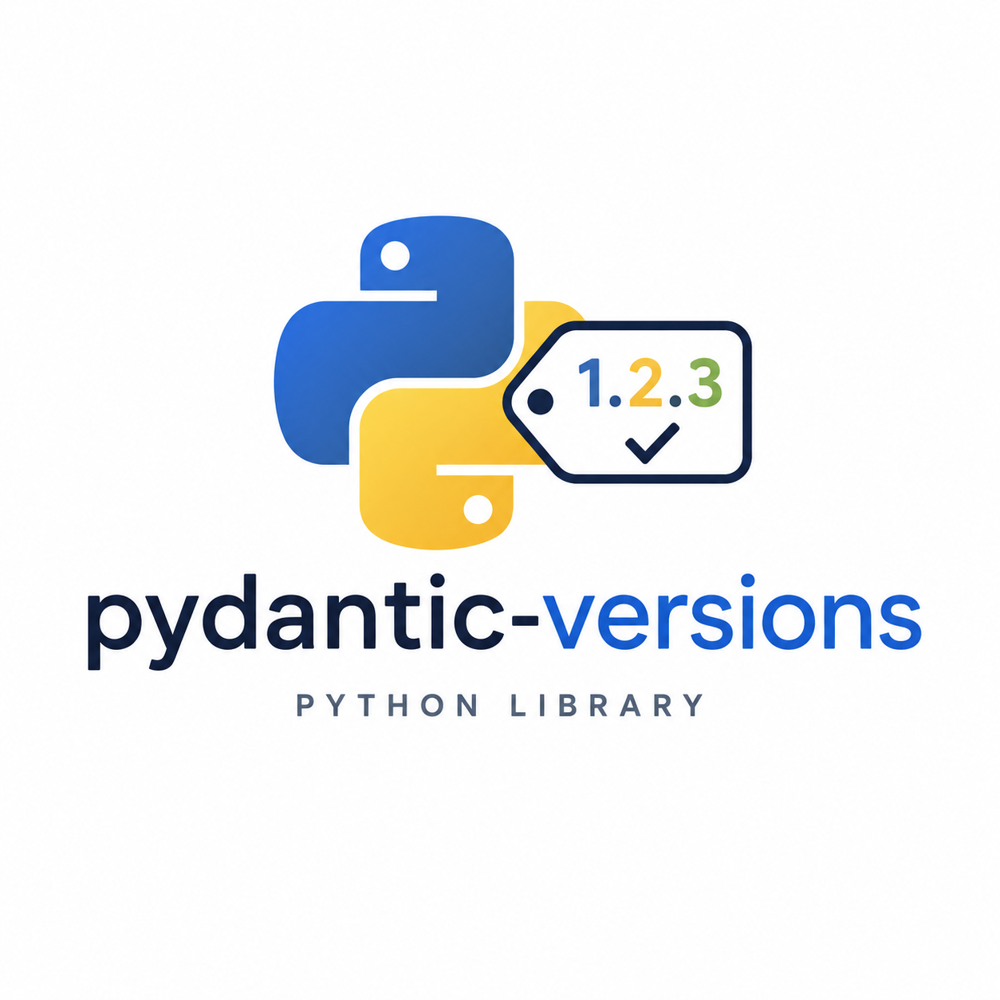

# pydantic-versions

Bring version control and history to your Pydantic schemas.

<p align="center">
  
</p>

`pydantic-versions` lets projects register ordered schema versions, derive historical Pydantic models from a current model, validate historical payloads, render historical config shapes, and upgrade data to the current model.

## Install

```bash
pip install pydantic-versions
```

With `uv`:

```bash
uv add pydantic-versions
```

## Example

Schema versions are independent from software versions. A config payload can declare
the schema it uses, and the latest software can still validate and upgrade it:

```python
from pydantic import BaseModel
from pydantic_versions import (
    dump_versioned,
    field_default,
    field_removed,
    migration,
    schema_version,
    validate_versioned,
    versioned_schema,
)


@versioned_schema(
    name="app_config",
    versions=["1", "2"],
    current="2",
    version_field="schema_version",
    missing_version="1",
)
@schema_version("1", patches=[
    field_default("timeout", 5.0),
    field_removed("new_feature"),
])
class AppConfig(BaseModel):
    timeout: float = 10.0
    retries: int = 3
    new_feature: bool = False


@migration(AppConfig, "1", "2")
def migrate_v1_to_v2(data: dict) -> dict:
    data.setdefault("new_feature", False)
    return data


result = validate_versioned(AppConfig, {"schema_version": "1", "retries": 2})
assert result.current_model == AppConfig(timeout=5.0, retries=2, new_feature=False)

v1_config = dump_versioned(AppConfig, version="1")
assert v1_config == {"timeout": 5.0, "retries": 3, "schema_version": "1"}
```

`missing_version` is only for legacy config files that do not contain a schema
version field. For example, `missing_version="1"` means "if a payload has no
`schema_version`, treat it as an old v1 config." If you do not set it,
unversioned input raises `MissingSchemaVersionError`.

The docs include a larger nested config example and adoption guidance for
deciding when to use patches, migrations, nested version fields, and legacy
unversioned fallbacks.

## Development

Install dependencies:

```bash
uv sync
```

Run the main checks:

```bash
make ci
```

Useful commands:

- `make format`: format with Ruff.
- `make lint`: lint and auto-fix with Ruff.
- `make typecheck`: run `ty`.
- `make test`: run pytest.
- `make docs-build`: build the docs site.
